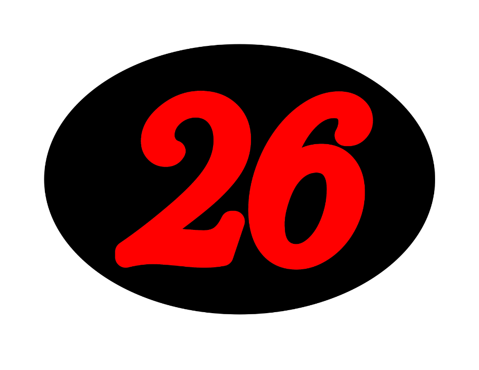
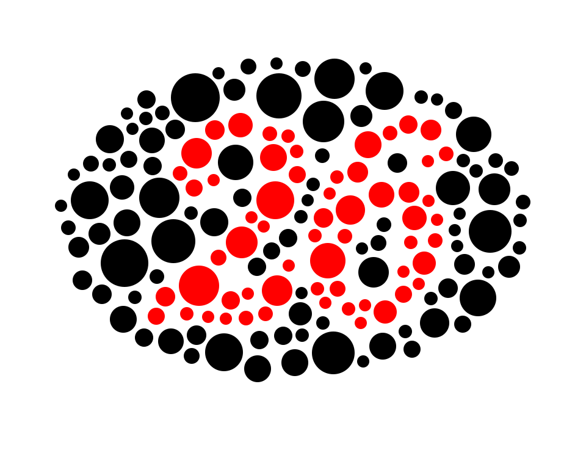
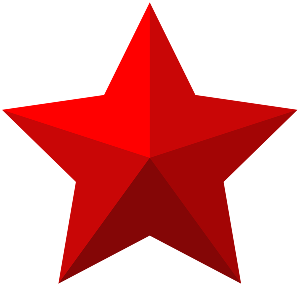
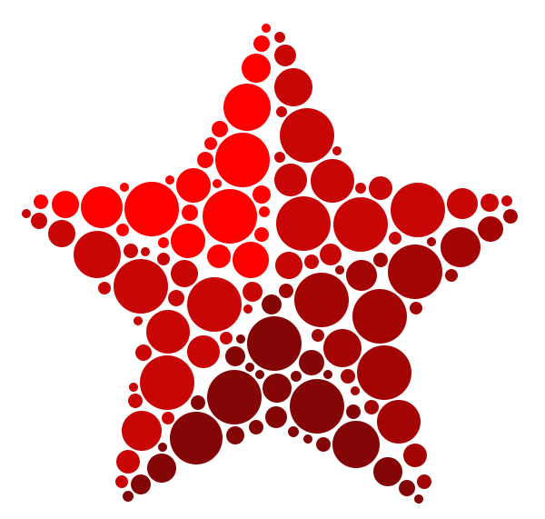
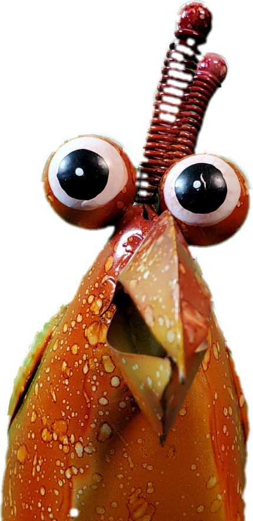
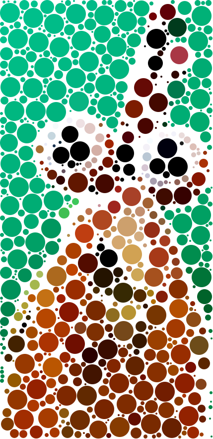

# png2svgcircles

This Groovy script takes a PNG as input and creates an SVG where
solidly filled areas will be filled with randomly sized
circles of the same color.

This code started its life as [Javascript gist](https://gist.github.com/gouldingken/8d0b7a05b0b0156da3b8) provided by
[gouldingken](https://gist.github.com/gouldingken). 

## Requirements for running

The easiest way to run this is to install [sdkman](https://sdkman.io/)
and then install compatible Java and Groovy packages.
* java 11.0.2-open
* groovy 3.0.14

## Usage (command line options)

```
Usage: png2svgcircles.groovy 
      [-hV] [-d=<doubleOffset>] -i=<inputPngFile>
      [-m=<maxRadius>] [-n=<numCircles>]
      -o=<outputSvgFile> [-r=<numRetriesPerCircle>]
      [-s=<spacing>] [-t=<tolerance>] [-x=<minRadius>]
      [-c=<omitColors>]...
Draws an SVG using random circles from a simple PNG
  -c, --color-skip=<omitColors>
      Colors (argb values) to be omitted. Can be included
      multiple times to omit multiple colors
  -d, --double-circles-offset=<doubleOffset>
      Double the placed circles with each doubled circle
      having the radius reduced by this much
  -h, --help
      Show this help message and exit.
  -i, --input=<inputPngFile>
      The input PNG file
  -m, --min-radius=<minRadius>
      The minimum circle radius - default is 10
  -n, --num-circles=<numCircles>
      Number of circles to try to place - default is 2000
  -o, --output=<outputSvgFile>
      The output SVG file
  -r, --retries=<numRetriesPerCircle>
      Number of retries for placing each circle - default
      is 1000
  -s, --spacing=<spacing>
      Minimum space between circles - default is 5
  -t, --color-tolerance=<tolerance>
      Color tolerance for color matching, in percentage.
      Range is 0.0 (any color will match) to 1.0 (exact
      color match required). The alpha channel is
      ignored. Default is 1.0
  -V, --version
      Print version information and exit.
  -x, --max-radius=<maxRadius>
      The maximum circle radius - default is 50
```

## Examples

### Example 1

Two color PNG with a transparent background at relatively low resolution. It includes circle doubling to provide tolerace for 3d printing designs, etc.

```bash
groovy png2svgcircles.groovy -i images/26-and-oval.png -o images/26-and-oval.svg -s 5 -m 10 -x 40 -c -1 -d 1
```

**Sample input file 26-and-oval.png**



**Example output file 26-and-oval.svg**



### Example 2

```bash
groovy png2svgcircles.groovy -i images/red-star.png -o images/red-star.svg -s 2 -m 5 -x 30 -c 0
```

**Sample input file red-star.png**



**Example output file red-star.svg**



### Example 3

And an example for [ResinChem Tech](https://www.youtube.com/@ResinChemTech) where we use the tolerance option, `-t`, to better handle images that have non-uniform coloring.

```bash
groovy png2svgcircles.groovy -i images/Chicken_New01.png -o images/Chicken_New01.svg -s 1 -m 2 -x 20 -t 0.5
```

**Sample input file Chicken_New01.png**



**Example output file Chicken_New01.svg**


